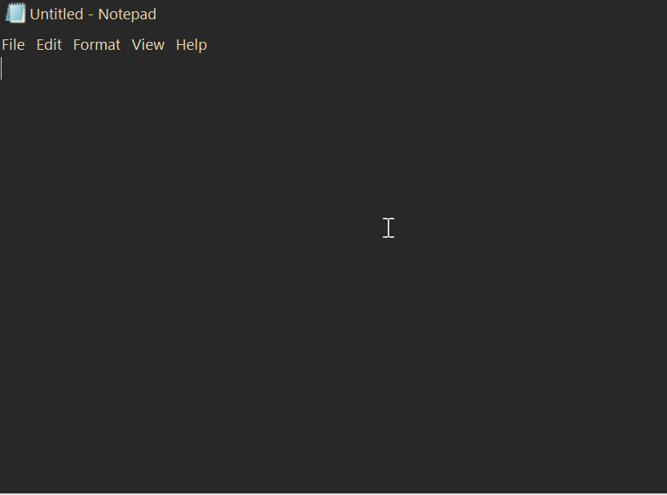

# En2Fa

### اصلاح متن تایپ‌شده با زبان اشتباه صفحه‌کلید در ویندوز

**نسخه 2.0.0**

[دانلود آخرین نسخه](https://github.com/millamilla/En2Fa/releases/latest)

---

## معرفی

<h1 dir="ltr">En2Fa</h1>

یک ابزار سبک و پرتابل برای ویندوز است که متن‌های تایپ‌شده با <strong>زبان اشتباه صفحه‌کلید</strong> را با فشردن میان‌بر دلخواه اصلاح می‌کند.

برنامه با استفاده از **الگوریتم تشخیص مبتنی بر وزن‌دهی**، بدون نیاز به انتخاب دستی، تشخیص می‌دهد که متن باید از فارسی به انگلیسی تبدیل شود یا برعکس.

در نسخه 2، الگوریتم تبدیل هوشمندتر شده و قابلیت‌های جدیدی مانند **تبدیل اعداد** و **جایگزینی عبارت‌های دلخواه** نیز اضافه شده است.

---

## پیش‌نمایش

**تبدیل متن تایپ‌شده با صفحه‌کلید انگلیسی به فارسی**

**تبدیل متن تایپ‌شده با صفحه‌کلید فارسی به انگلیسی**

**اصلاح آخرین کلمه**

**اصلاح متن انتخاب‌شده**

**جایگزینی عبارت‌های دلخواه**

---

## ویژگی‌ها

<ul dir="rtl">
  <li>
    <strong>تبدیل هوشمند فارسی ↔ انگلیسی</strong>
    <ul>
      <li>تشخیص خودکار جهت اصلاح با استفاده از الگوریتم وزن‌دهی</li>
      <li>الگوریتم بهبودیافته در نسخه 2 برای تشخیص و تبدیل دقیق‌تر متن</li>
    </ul>
  </li>

  <li>
    <strong>تبدیل اعداد</strong>
    <ul>
      <li>تبدیل اعداد فارسی و انگلیسی در کنار متن</li>
    </ul>
  </li>

  <li>
    <strong>جایگزینی عبارت‌های دلخواه</strong>
    <ul>
      <li>امکان تعریف عبارت‌های دلخواه</li>
      <li>با تایپ عبارت تعیین‌شده، متن موردنظر به‌صورت خودکار جایگزین می‌شود</li>
    </ul>
  </li>

  <li>
    <strong>دو میان‌بر مستقل و کاملاً قابل تنظیم</strong>
    <ul>
      <li>میان‌بر اول: اصلاح متن انتخاب‌شده یا کل خط در صورت انتخاب نبودن متن</li>
      <li>میان‌بر دوم: اصلاح آخرین کلمه</li>
    </ul>
  </li>

  <li>
    <strong>تنظیم مستقل رفتار هر میان‌بر</strong>
    <ul>
      <li>برای هر میان‌بر می‌توان تعیین کرد که پس از اصلاح، زبان صفحه‌کلید ویندوز به‌صورت خودکار تغییر کند یا بدون تغییر باقی بماند.</li>
    </ul>
  </li>

  <li>
    <strong>حفظ کامل فاصله‌ها و علائم نگارشی</strong>
  </li>

  <li>
    <strong>فعال یا غیرفعال کردن سریع برنامه</strong>
    <ul>
      <li>از طریق آیکون <strong>System Tray</strong></li>
    </ul>
  </li>

  <li>
    <strong>کاملاً Portable و بدون نیاز به نصب</strong>
  </li>
</ul>

---

## نسخه 2.0.0

### ✨ تغییرات جدید

- 🔢 اضافه شدن قابلیت **تبدیل اعداد**
- 🧠 **هوشمندتر شدن الگوریتم تبدیل متن**
- ⚡ اضافه شدن قابلیت **جایگزینی عبارت‌های دلخواه با تایپ عبارت مشخص‌شده**

---

## دانلود

آخرین نسخه برنامه را می‌توانید از بخش **Releases** دریافت کنید.

[دانلود En2Fa](https://github.com/millamilla/En2Fa/releases/latest)

---

## توسعه

کد منبع پروژه با **AutoHotkey v2** نوشته شده است.

برای اجرا یا کامپایل برنامه از روی سورس، فایل `source/En2Fa.ahk` را با AutoHotkey v2 اجرا یا کامپایل کنید.

---

## مجوز

این پروژه تحت مجوز **MIT License** منتشر شده است.

