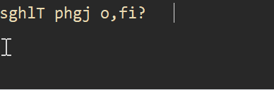
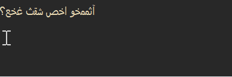
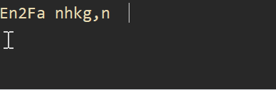
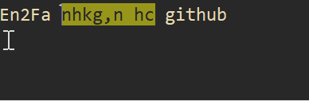

# En2Fa

### اصلاح متن تایپ‌شده با زبان اشتباه صفحه‌کلید در ویندوز

---

## معرفی

برنامه **En2Fa**، ابزاری سبک و پرتابل برای ویندوز است که متن‌های تایپ‌شده با **زبان اشتباه صفحه‌کلید** را با فشردن میان‌بر دلخواه اصلاح می‌کند.

برنامه با استفاده از **الگوریتم تشخیص مبتنی بر وزن‌دهی**، بدون نیاز به انتخاب دستی، تشخیص می‌دهد که متن باید از فارسی به انگلیسی تبدیل شود یا برعکس.

---

## پیش‌نمایش

 تبدیل متن تایپ‌شده با صفحه‌کلید انگلیسی به فارسی

 تبدیل متن تایپ‌شده با صفحه‌کلید فارسی به انگلیسی

 اصلاح آخرین کلمه

 اصلاح متن انتخاب‌شده

---
## ویژگی‌ها

<ul dir="rtl">
  <li>
    ✅ <strong>دو میان‌بر مستقل و کاملاً قابل تنظیم</strong>
    <ul>
      <li>اصلاح متن انتخاب‌شده یا کل خط</li>
      <li>در صورت انتخاب نبودن متن، اصلاح خودکار کل خط جاری</li>
      <li>اصلاح آخرین کلمه</li>
    </ul>
  </li>

  <li>
    ✅ <strong>تنظیم مستقل رفتار هر میان‌بر</strong>
    <ul>
      <li>برای هر میان‌بر می‌توان تعیین کرد که پس از اصلاح، زبان صفحه‌کلید ویندوز به‌صورت خودکار تغییر کند یا بدون تغییر باقی بماند.</li>
    </ul>
  </li>

  <li>
    ✅ <strong>تشخیص خودکار جهت اصلاح</strong>
    <ul>
      <li>تبدیل فارسی ↔ انگلیسی با استفاده از الگوریتم وزن‌دهی</li>
    </ul>
  </li>

  <li>
    ✅ <strong>حفظ کامل فاصله‌ها و علائم نگارشی</strong>
  </li>

  <li>
    ✅ <strong>فعال یا غیرفعال کردن سریع برنامه</strong>
    <ul>
      <li>از طریق آیکون <strong>System Tray</strong></li>
    </ul>
  </li>

  <li>
    ✅ <strong>کاملاً Portable و بدون نیاز به نصب</strong>
  </li>
</ul>

---

## توسعه

کد منبع پروژه با **AutoHotkey v2** نوشته شده است.

برای اجرا یا کامپایل برنامه از روی سورس، فایل source/En2Fa.ahk را با AutoHotkey v2 اجرا یا کامپایل کنید.

---

## مجوز

این پروژه تحت مجوز **MIT License** منتشر شده است.

